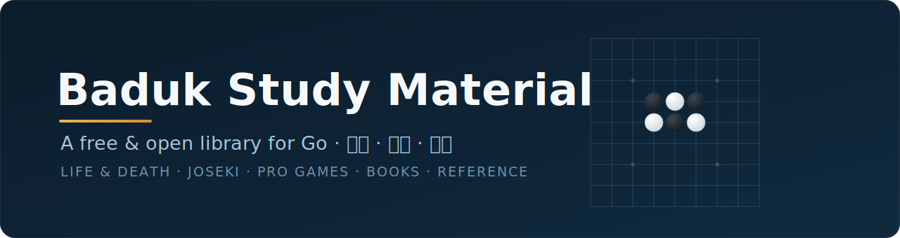

<div align="center">



<br><br>

<a href="https://github.com/benjaminmantle/baduk-study-material/stargazers"></a>
&nbsp;
&nbsp;
&nbsp;
&nbsp;

<br><br>

**[Start where you are](#start)** &nbsp;·&nbsp; **[The library](#library)** &nbsp;·&nbsp; **[Map](#map)** &nbsp;·&nbsp; **[Find by goal](#goal)** &nbsp;·&nbsp; **[Catalog](CATALOG.md)** &nbsp;·&nbsp; **[Study paths](docs/study-paths.md)**

</div>

<br>

> **Go positions and game records are a shared human heritage — they should be open to everyone.**
> This is a hand-curated library of the best *freely available* material for studying
> **Go** (囲碁) · **Baduk** (바둑) · **Weiqi** (围棋) — sorted by topic and by strength, so you
> always know what to study next.

<a id="start"></a>

## 🚀 Start where you are

New material is exciting, but studying the *wrong* thing for your level is the classic way to
stall. Find your row, lean into its column — and cheerfully **defer** the rest until later.

| Stage | You are… | 🟢 Lean into | 🟠 Not yet — defer |
|:--|:--|:--|:--|
| 🌱 **Beginner** | ~30k–18k · just learned the rules | [Rules & basics](01-rules-basics/) · *very easy* [tsumego](02-life-and-death/graded/) · lots of 9×9 / 13×13 · a few [proverbs](12-proverbs-principles/) | Joseki memorization, fuseki theory, endgame, pro-game study — all just noise right now |
| 🌿 **DDK** | ~18k–10k · groups mostly live | daily [graded tsumego](02-life-and-death/graded/) · basic [tesuji](03-tesuji/) · opening **principles** ([04](04-opening-fuseki/)) · move to 19×19 · review your losses | Joseki *dictionaries* · deep counting · positional judgment |
| 🍃 **SDK** | ~9k–1k · chasing dan | harder [tsumego](02-life-and-death/) + [tesuji](03-tesuji/) daily · a **few** [joseki](05-joseki/) with the *ideas* · [endgame](08-endgame-yose/) · [whole games](10-whole-games/) played fast · [fighting](07-middlegame-fighting/) · [shape](06-shape/) | grinding full joseki dictionaries · *Mathematical Go* · hyper-precise counting |
| 🌳 **Dan** | 1d and up | [special shapes](02-life-and-death/special-shapes/) · [positional judgment](09-positional-judgment/) · [AI-era games](10-whole-games/ai-era/) + [study with AI](13-ai-and-tools/) · deep endgame & joseki **choice** | nothing's off-limits — just chase your **measured** weak spots over hoarding more material |

<sub>Ranges are loose on purpose — jump ahead when you're curious, drop back when you're stuck. The one habit that works at *every* level: **a little life & death every day.** Full daily routines → **[study-paths.md](docs/study-paths.md)**.</sub>

<a id="library"></a>

## 🗺️ The library

Folders are **numbered as a rough progression** — but dip in anywhere. Each has its own guide.

| # | Topic | For | | # | Topic | For |
|:--:|:--|:--:|:--:|:--:|:--|:--:|
| **[01](01-rules-basics/)** | Rules & Basics | Beg | | **[08](08-endgame-yose/)** | Endgame / Yose | SDK+ |
| **[02](02-life-and-death/)** | Life & Death ⭐ | all | | **[09](09-positional-judgment/)** | Positional Judgment | Dan |
| **[03](03-tesuji/)** | Tesuji | DDK+ | | **[10](10-whole-games/)** | Whole Games ⭐ | all |
| **[04](04-opening-fuseki/)** | Opening / Fuseki | DDK+ | | **[11](11-handicap/)** | Handicap | DDK+ |
| **[05](05-joseki/)** | Joseki | SDK+ | | **[12](12-proverbs-principles/)** | Proverbs | all |
| **[06](06-shape/)** | Shape | SDK+ | | **[13](13-ai-and-tools/)** | AI & Tools | all |
| **[07](07-middlegame-fighting/)** | Middlegame & Fighting | SDK+ | | **[14](14-reference/)** | Reference | all |

📚 **[books/](books/)** free & public-domain books &nbsp;·&nbsp; 🗂️ **[CATALOG.md](CATALOG.md)** everything indexed &nbsp;·&nbsp; 🧭 **[docs/](docs/)** study paths · glossary · provenance

<sub>Housekeeping: `_todo/` (e.g. tsumego photos awaiting SGF) · `_inbox/` (new, unsorted drops).</sub>

<a id="map"></a>

### 🧭 Map of the collection

<sub>⭐ **Don't-miss:** [422 graded problems *with solutions*](02-life-and-death/graded/gogameguru-weekly/) · [Kogo's Joseki Dictionary](05-joseki/) · [Shape Up!](06-shape/) · [the classic masters](10-whole-games/classic/) &amp; [AlphaGo games](10-whole-games/ai-era/) · [Cho's shape-organized life & death](02-life-and-death/collections/importable-sgf/).</sub>

<details>
<summary><b>Expand the full directory map</b></summary>

```text
baduk-study-material/
├─ 01-rules-basics/
├─ 02-life-and-death/          ⭐ the engine room — do a little every day
│  ├─ graded/                  gogameguru-weekly (422, with solutions) · drills-pdf
│  ├─ special-shapes/          L/J-group · carpenter's square · from-joseki
│  └─ collections/             importable classic SGF · scanned books · problem-books-pdf
├─ 03-tesuji/                  + booklets-pdf (Great Tesuji Encyclopedia, Segoe…)
├─ 04-opening-fuseki/
├─ 05-joseki/                  Kogo's Joseki Dictionary ⭐
├─ 06-shape/                   Shape Up! ⭐
├─ 07-middlegame-fighting/     invasions + fighting booklets
├─ 08-endgame-yose/            endgame booklets (Go Seigen, Sakata, Nie Weiping…)
├─ 09-positional-judgment/
├─ 10-whole-games/             ⭐ classic/ · modern/ · ai-era/ · by-tournament/ · collections/
├─ 11-handicap/
├─ 12-proverbs-principles/
├─ 13-ai-and-tools/            KataGo · KaTrain · Lizzie · how to study with AI
├─ 14-reference/               ranks · rules · glossary
├─ books/                      free & public-domain (Arthur Smith 1908, Relentless…)
├─ docs/                       CATALOG · study-paths · glossary · provenance
├─ _inbox/                     unsorted drops
└─ _todo/                      e.g. tsumego photos → SGF
```
</details>

<a id="goal"></a>

## 🎯 Find by goal

| I want to… | Go to |
|:--|:--|
| **Read deeper / stop misreading** | [02 Life & Death](02-life-and-death/) + [03 Tesuji](03-tesuji/), a little every day |
| **Fix aimless openings** | [04 Fuseki](04-opening-fuseki/) + play through [Shusaku](10-whole-games/classic/) |
| **Stop losing won games** | [08 Endgame](08-endgame-yose/) — the most underrated points on the board |
| **Survive fights** | [07 Fighting](07-middlegame-fighting/) + capturing-race practice |
| **Make efficient shape** | [06 Shape](06-shape/) — read *Shape Up!* once, cover to cover |
| **Understand what AI changed** | [10 AI-era games](10-whole-games/ai-era/) + [13 study with AI](13-ai-and-tools/) |

## ▶️ Opening the files

- **`.sgf`** (games & problems) — free viewers: **online** [OGS](https://online-go.com), EidoGo · **desktop** [Sabaki](https://sabaki.yichuanshen.de), CGoban, Drago. To *analyze with AI*, see **[13 · AI & Tools](13-ai-and-tools/)**.
- **`.pdf`** any reader &nbsp;·&nbsp; **`.tgz` / `.7z`** game archives — extract with any unzip tool (7-Zip, `tar`).

## 🤝 Contributing · ⚖️ License

Contributions are welcome — even "here's a link to a great free resource" counts; see
**[CONTRIBUTING.md](CONTRIBUTING.md)**. Game records are facts and freely shared; a few
community-shared items are grey and flagged **⚠** in **[docs/provenance.md](docs/provenance.md)**.
Hold rights to something here and want it gone? Open an issue — see **[LICENSE.md](LICENSE.md)**.

<br>

<div align="center">
<sub><b>Rank shorthand</b> — Beginner 30k–20k · DDK 20k–10k · SDK 9k–1k · Dan 1d+ &nbsp;•&nbsp; <b>⭐</b> essential · <b>⚠</b> grey licensing</sub>
<br><br>
<sub>Built for everyone who loves this game. Free &amp; open — now pull up a board and get stronger. ●&#8202;○</sub>
</div>
